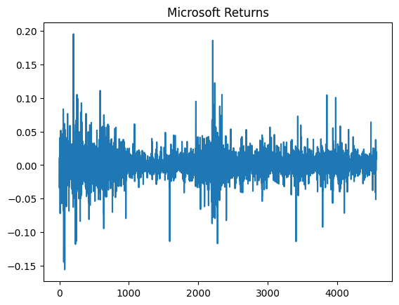

Average annual return:  0.09985839482852632
Annualized Standard deviation:  0.3070304505826315
Annualized Variance:  0.09426769758497373
Third Moment (skewness):  0.21935459193067805
Excess Kurtosis of returns:  10.314572618025519
Fourth Moment (kurtosis):  13.314572618025519
ShapiroResult(statistic=np.float64(0.9003648428746107), pvalue=np.float64(1.63104738942256e-47))
P-value:  1.63104738942256e-47
The returns are not normally distributed